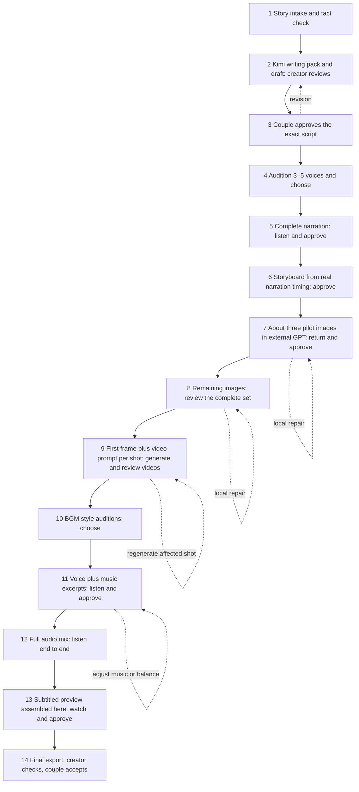

# Wedding Video Guided Wizard

[中文](README.md) | **English**

A **14-step guided skill** for turning a couple's real story and photos into a subtitled wedding film. It tells the creator what to do now, what to return, and who needs to approve it before moving on.

[English story card](https://aaronyi97.github.io/wedding-video-guided-wizard/?lang=en) · [Download the skill](https://github.com/aaronyi97/wedding-video-guided-wizard/releases/latest) · [English skill instructions](SKILL.en.md) · [Detailed workflow](references/en/workflow.md)

Chinese is the default audience and repository homepage. English users use **the same installation and production workflow**, with English guidance, intake labels, writing/video package instructions, and word-aware subtitles. Follow the 中文 / English links to switch documentation, or use the language button on the story card.

The card retains the original five-act questionnaire and layout. Forward it to the couple, who fill it in on a computer or phone, copy the completed text, and send it through their usual messaging app. Original photos are sent separately. There is no phone-number field, login or backend submission. Text drafts stay in the browser and can be cleared. Switching the interface preserves typed answers; it does not translate their words.

## Install and start

Send this to Codex:

> Please use skill-installer to install https://github.com/aaronyi97/wedding-video-guided-wizard. The skill is at the repository root; use wedding-video-guided-wizard as the installation name. Tell me how to start it after installation.

Alternatively, extract the release ZIP as a folder named `wedding-video-guided-wizard` inside your host's configured skills directory. Install the entire package, not only SKILL.en.md. A compatible host needs local file and command capabilities; automatic discovery and media tooling depend on that host's configuration.

Then say:

> Use $wedding-video-guided-wizard to start a wedding video in English. First give me the story card I can send to the couple, then guide me through one step at a time.

For an existing order, supply its project directory. The assistant reads PROJECT_STATE.json and resumes. Keep client material and generated media in that separate directory, outside this public repository. An English-speaking creator can also make a Chinese-language film: state the desired film language in the brief. Changing guidance language does not rewrite already approved text.

## Workflow and human checkpoints

Each reply starts with a clear progress label, for example:

**[7/14 | Three pilot images | Awaiting returned images | 7 steps remaining]**



Every step involves returned material or an explicit human decision. The couple approves at step 3 and accepts the film after the creator's export check at step 14. The creator reviews the other steps. Rework preserves unrelated approved assets and does not add new step numbers.

## What the skill protects

- **Interpret the presentation, never invent the experiences.** Every paragraph and shot traces back to the couple's intake or a confirmed supplement. The five-act card is not a fixed plot.
- **Kimi K3 is strongly recommended for writing.** The ZIP and separate copyable text embed the actual facts, narrative plan and an understated, vivid, natural spoken style. English prose adapts the writing method rather than literally translating Chinese expressions.
- **All image generation and editing are manual in an external GPT conversation.** The user uploads mapped reference photos and pastes the supplied prompt. A configured image API does not let Codex generate or edit images automatically.
- **Complete narration comes before the formal storyboard.** Real speech and pauses determine shot timing, reducing forced edits later.
- **Audition before scaling up.** Approve image pilots before the remaining images, and music styles plus mixed excerpts before the full mix. Video prompts begin from the actual selected first frame. Suno V5.5 is recommended where available; user-selected services or manual generation are supported.
- **Approval is version-specific.** Technical checks, assistant review, creator listening/viewing and couple acceptance remain separate.

## Runtime and language support

`wizard.py` handles state, replies supporting approvals, file hashes, revisions and writing/video ZIPs. `media.py` provides optional official Kimi and Doubao TTS adapters, local mixing, English/Chinese subtitle burning and video assembly. No image-generation entry point or guessed universal Suno/video API is bundled.

Use your own available, authorized accounts for paid generation. Confirm the selected voice actually supports English and the desired accent; a Chinese voice or API key alone is insufficient. If a recommended provider/model is unavailable, the assistant explains the gap and guides a user-selected alternative or manual return path while keeping the same approval gates.

State and writing packages require Python 3.9+. Image decoding needs Pillow. Local audio/video work needs FFmpeg, ffprobe, Pillow and a font that supports the subtitle language. English subtitles wrap at word boundaries, with Latin-font fallbacks; Chinese retains its existing layout. The assistant checks dependencies only when relevant. See the [execution guide](references/en/execution.md).

## Validation and contributing

```bash
python3 -m pip install Pillow
python3 -m unittest discover -s tests -v
python3 scripts/media.py doctor
```

Optional media smoke test: `python3 tests/integration_smoke.py --output /absolute/path/to/new-test-project --lang en`. Use a new directory in the host's permitted media storage. It uses synthetic color frames and tones; no paid API calls.

For browser checks, serve docs with `python3 -m http.server 8734 --bind 127.0.0.1 --directory docs`, then run `node tests/browser-smoke.cjs` and `node tests/browser-language.cjs` in a Node environment with Playwright installed. `BROWSER_BIN` can select a browser executable.

See [validation scope and limitations](VALIDATION.en.md). Tests do not establish the quality of a real commissioned film, every paid provider/account, or every physical phone and messaging-app browser. Remove names, photos, complete client stories and credentials from issue reports; synthetic examples are easier to reproduce.

## Credits and license

This is an independent skill. Its proactive guidance draws on the author's [image-story-video-wizard](https://github.com/aaronyi97/image-story-video-wizard). The story card reuses the author's existing wedding-story-video-wizard questionnaire, adapted for copying and returning through chat. English uses the same questions and production gates. No real client story, photos or audio are included.

[MIT license](LICENSE), retaining the original questionnaire's inherited notice.
